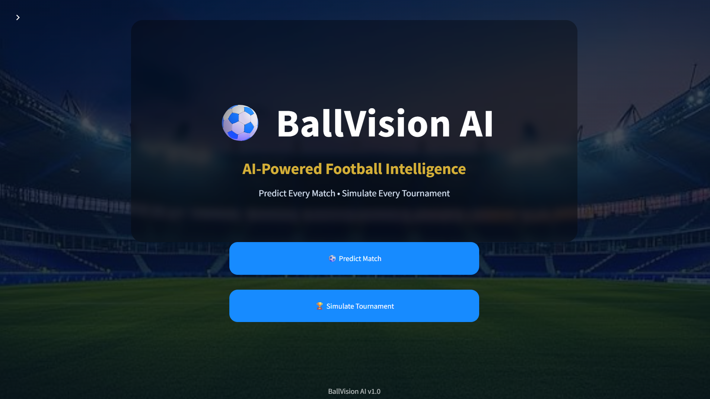
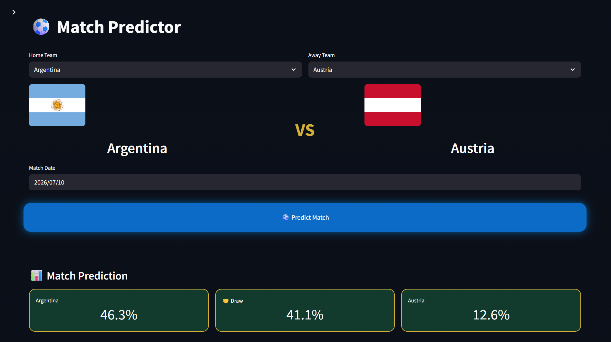
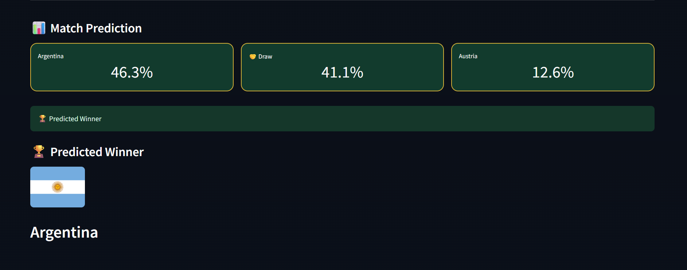
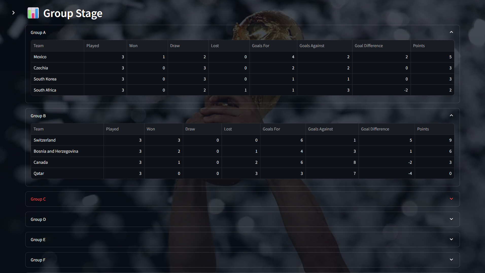
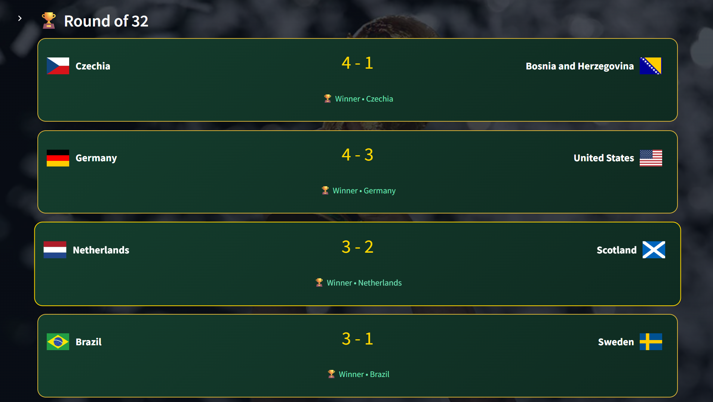
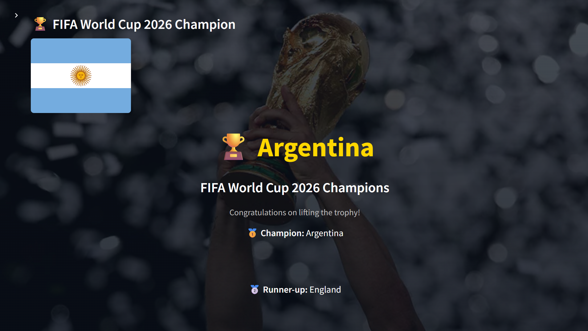

# ⚽ BallVision AI

AI-powered football match prediction and FIFA World Cup tournament simulation using Machine Learning.



---


## 📖 Overview

BallVision AI is a Machine Learning-powered football analytics platform capable of predicting international football matches and simulating an entire FIFA World Cup tournament.

The prediction engine combines historical international match data, Elo ratings, FIFA rankings, and recent team form to estimate match outcomes. The tournament simulator uses these predictions to recreate every stage of the FIFA World Cup—from the Group Stage to the Final—in a modern interactive Streamlit interface.

## Features

✅ Match Prediction
- Win / Draw / Loss probabilities
- Logistic Regression model
- Elo Ratings
- FIFA Rankings
- Team Form
- Historical International Match Data

✅ Tournament Simulator
- Group Stage
- Round of 32
- Round of 16
- Quarter Finals
- Semi Finals
- Final
- Champion

✅ User Interface
- Interactive Streamlit app
- Country flags
- Tournament brackets
- Progress animations
- Champion celebration

---

## Machine Learning

Model:
- Logistic Regression

Features:
- Elo Difference
- FIFA Rankings
- Team Form
- Goal Difference
- Historical Performance

Accuracy:
54.2%

---

## 🛠 Tech Stack

- Python
- Streamlit
- Pandas
- NumPy
- Scikit-Learn
- Joblib

---

## 🚀 Installation

```bash
git clone https://github.com/<your-username>/ballvision-ai.git
```

```bash
cd ballvision-ai
```

```bash
pip install -r requirements.txt
```

```bash
streamlit run app.py
```

## 📂 Project Structure

```text
fifa_world_cup_predictor/
│
├── app.py                      # Streamlit application entry point
├── README.md
├── LICENSE
├── requirements.txt
├── .gitignore
│
├── assets/                     # Images, flags and static resources
│   ├── flags/
│   └── images/
│
├── datasets/                   # Historical football datasets
├── saved_models/               # Trained ML models (.pkl)
├── screenshots/                # README screenshots
├── styles/                     # Custom CSS styling
│
├── pages/                      # Streamlit application pages
│   ├── predictor.py
│   └── simulator.py
│
├── src/
│   ├── feature_engineering/    # Feature generation pipeline
│   ├── models/                 # Model training & evaluation
│   ├── prediction/             # Match prediction logic
│   ├── preprocessing/          # Data preprocessing
│   ├── simulation/             # Tournament simulation engine
│   ├── ui/                     # UI helper components
│   ├── utils/                  # Utility functions
│   └── visualization/          # Visualizations
│
├── tests/                      # Unit tests
├── notebooks/                  # Model experimentation
└── reports/                    # Project reports & documentation
```

### Project Architecture

- **Feature Engineering** – Builds team statistics, Elo ratings, recent form and engineered features.
- **Prediction Engine** – Uses a trained Logistic Regression model to predict match outcomes.
- **Tournament Simulator** – Simulates the complete FIFA World Cup from the Group Stage to the Final.
- **UI Layer** – Interactive Streamlit interface with match prediction, tournament simulation and visualization.


# 📸 Screenshots

## 🏠 Home Page


---

## ⚽ Match Predictor

Predict the outcome of any international football match using the trained Machine Learning model.

### Predictor Page



### Prediction Result



---

## 🏆 Tournament Simulator

Run a complete FIFA World Cup simulation from the Group Stage to the Final.

### Simulator Home


### Group Stage



### Knockout Stage



### Champion Screen



---

## Future Improvements

- Live FIFA Rankings
- xG Model
- Interactive Tournament Bracket
- Player Statistics
- Team Comparison Dashboard

## 📄 License

This project is licensed under the MIT License. See the [LICENSE](LICENSE) file for details.